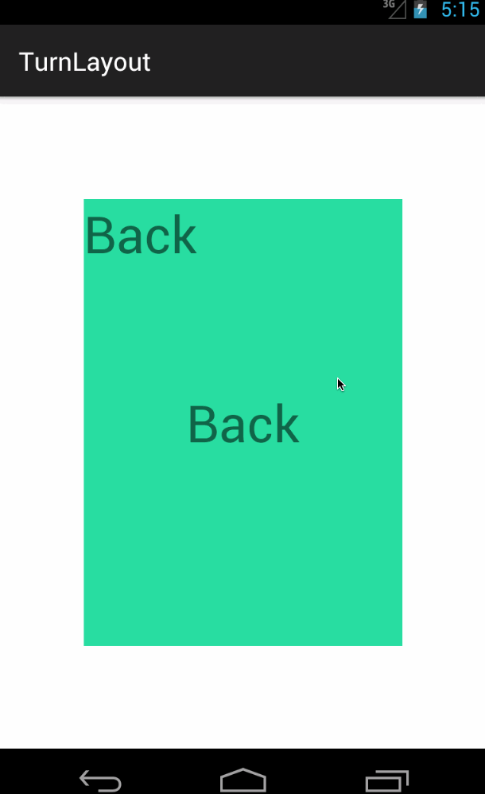
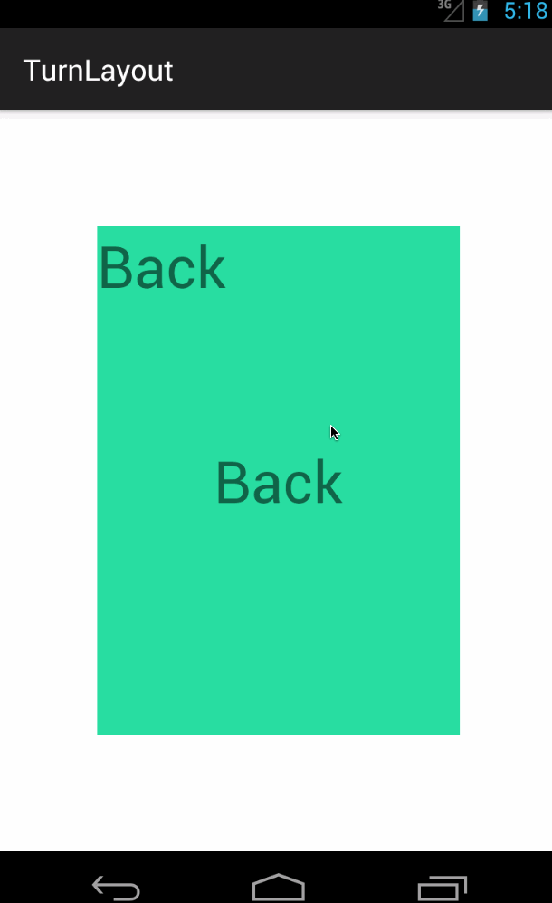

TwoSidedLayout
===========

TwoSidedLayout is a view that can turn to show the back side.
This library is using [Rebound](http://facebook.github.io/rebound/) to render animations.

## Screenshots





##Usage

### Gradle
```
dependencies {
   	compile 'com.liuguangqiang.twosidedlayout:library:1.0.0'
}
```

### Maven
```
<dependency>
  	<groupId>com.liuguangqiang.twosidedlayout</groupId>
  	<artifactId>library</artifactId>
  	<version>1.0.0</version>
  	<type>aar</type>
</dependency>
```

### Layout
TwoSidedLayout must contains only two direct children.

```
<com.liuguangqiang.TwoSidedLayout
        android:layout_width="match_parent"
        android:layout_height="match_parent">

        <RelativeLayout
            android:id="@+id/back"
            android:layout_width="match_parent"
            android:layout_height="match_parent"></RelativeLayout>

        <RelativeLayout
            android:id="@+id/front"
            android:layout_width="match_parent"
            android:layout_height="match_parent"></RelativeLayout>

    </com.liuguangqiang.TwoSidedLayout>
```

### Orientation

```
HORIZONTAL

VERTICAL
```
### Tension and Friction
TwoSidedLayout is using [Rebound](http://facebook.github.io/rebound/) to render animations.
Change tension and friction will influence the animation effects in Rebound. So TwoSidedLayout create a method to change these.

```
public void setTensionAndFriction(double tension, double friction)
```

## License

    Copyright 2015 Eric Liu

    Licensed under the Apache License, Version 2.0 (the "License");
    you may not use this file except in compliance with the License.
    You may obtain a copy of the License at

       http://www.apache.org/licenses/LICENSE-2.0

    Unless required by applicable law or agreed to in writing, software
    distributed under the License is distributed on an "AS IS" BASIS,
    WITHOUT WARRANTIES OR CONDITIONS OF ANY KIND, either express or implied.
    See the License for the specific language governing permissions and
    limitations under the License.


